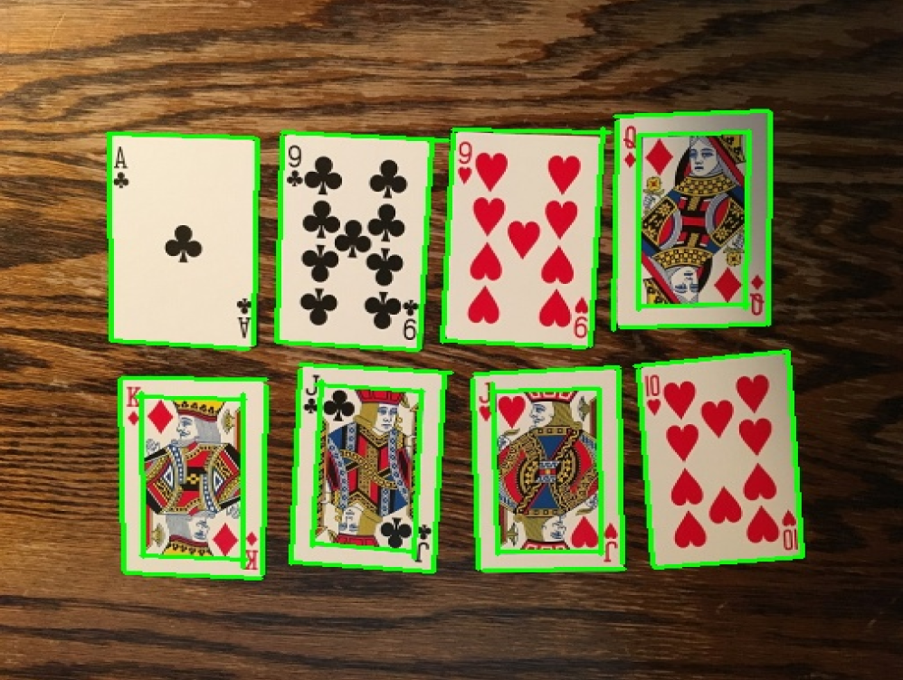

<h3>deeplearn-java</h3>	

<table border="1">
  <tr>
    <th></th>
  </tr>
</table>

<table class="table">
<thead>
<tr>
<th>
number
</th>
<th>
project
</th>
<th>
remark
</th>
</tr>
</thead>
<tbody>
<tr><td>1</td><td>action_rec_djl</td><td>  MXNet image classification for human action recognition, DJL inference</td></tr>
<tr><td>2</td><td>anime_gan</td><td>  Deploying face anime transformation using ONNXRuntime—AnimeGAN</td></tr>
<tr><td>3</td><td>bert_qa_djl</td><td>  BERT reading comprehension (input paragraph and question, provide answer), DJL inference</td></tr>
<tr><td>4</td><td>big_gan_djl</td><td>  BigGAN image generation, batch image generation by category, DJL inference</td></tr>
<tr><td>5</td><td>bise_net</td><td>  Facial parsing using BiSeNet</td></tr>
<tr><td>6</td><td>chexnet</td><td>  Wu Enda's team pneumonia detection model - CheXNet</td></tr>
<tr><td>7</td><td>chinese2english_translation_djl</td><td>  Translation Chinese => English, Chinese segmentation, then translation, DJL inference</td></tr>
<tr><td>8</td><td>chinese_error_recovery_macbert4csc</td><td>  Load MacBERT model for Chinese spelling correction</td></tr>
<tr><td>9</td><td>chinese_nlp_roberta</td><td>  Chinese word completion prediction with RoBERTa</td></tr>
<tr><td>10</td><td>chinese_ocr_lite</td><td>  The lightest Chinese OCR</td></tr>
<tr><td>11</td><td>chinese_segment_lightltp_1</td><td>  Chinese segmentation with LightLTP, Chinese lexical analysis (segmentation, part-of-speech tagging)</td></tr>
<tr><td>12</td><td>chinese_segment_lightltp_2</td><td>  Chinese segmentation with LightLTP, Chinese lexical analysis (segmentation, part-of-speech tagging => named entity recognition)</td></tr>
<tr><td>13</td><td>clip_image_text_compare_djl</td><td>  CLIP model for image-text understanding (OpenAI), DJL deployment, compare text and images, calculate image-text relevance</td></tr>
<tr><td>14</td><td>crowd_density_dec_djl</td><td>  Crowd density detection (PaddlePaddle-CrowdNet), people counting, crowd density map, DJL inference</td></tr>
<tr><td>15</td><td>dbnet_barcode_det</td><td>  DBNet for barcode detection</td></tr>
<tr><td>16</td><td>deeplabv3_obj_segmentation_djl</td><td>  DeepLabV3 instance segmentation, DJL inference</td></tr>
<tr><td>17</td><td>distilbert_sentiment_analysis</td><td>  DistilBERT sentiment analysis (English text), DJL inference</td></tr>
<tr><td>18</td><td>e2_pose_detection</td><td>  E2Pose human keypoint detection</td></tr>
<tr><td>19</td><td>e2_pose_detection_video</td><td>  E2Pose human keypoint detection</td></tr>
<tr><td>20</td><td>english_segment_ner</td><td>  English named entity recognition with HuggingFace-RoBERTa NER (NLP)</td></tr>
<tr><td>21</td><td>face_alignment_mesh_pose</td><td>  Face detection + alignment (dense point 3D reconstruction, also known as mesh reconstruction)</td></tr>
<tr><td>22</td><td>face_det_retina_djl</td><td>  RetinaFace model for face detection (5 key points), DJL inference</td></tr>
<tr><td>23</td><td>face_det_ultra_light_djl</td><td>  Ultra-Light-Fast model for face detection (5 key points), DJL inference</td></tr>
<tr><td>24</td><td>face_feature_extraction_djl</td><td>  Face feature extraction (512 dimensions), similarity comparison, DJL inference</td></tr>
<tr><td>25</td><td>face_land_mark</td><td>  Face landmark detection, also known as face alignment</td></tr>
<tr><td>26</td><td>face_rec_det_insightface_pcn_1</td><td>  Face detection (InsightFace) + age and gender detection + landmark recognition + feature extraction + face matching</td></tr>
<tr><td>27</td><td>face_rec_det_insightface_pcn_2</td><td>  Face detection (PCN) + age and gender detection + landmark recognition + feature extraction + face matching</td></tr>
<tr><td>28</td><td>face_rec_det_insightface_pcn_3</td><td>  Similarity evaluation face detection => landmark detection => face alignment => feature extraction => similarity calculation</td></tr>
<tr><td>29</td><td>face_rec_det_insightface_pcn_4</td><td>  Face feature extraction => Elasticsearch face retrieval</td></tr>
<tr><td>30</td><td>face_rec_det_sface</td><td>  Face detection and recognition, SFace face detection (Yunet) + face encoding (128 dimensions)</td></tr>
<tr><td>31</td><td>first_order_motion_model_jdl</td><td>  Ant black and white effect, First Order Motion Model using JDL inference</td></tr>
<tr><td>32</td><td>french2english_translation_djl</td><td>  Translation French => English, DJL inference</td></tr>
<tr><td>33</td><td>gfp_gan_v1</td><td>  GFP-GAN V1 for face photo restoration, increases clarity</td></tr>
<tr><td>34</td><td>google_move_net_people_key_point</td><td>  Google MoveNet human 17 key points detection</td></tr>
<tr><td>35</td><td>google_move_net_people_key_point_video</td><td>  Google MoveNet human 17 key points detection</td></tr>
<tr><td>36</td><td>hand_3d_landmark</td><td>  Hand keypoint detection 3D, the attention model needs to combine palm detection, so direct input of palm images is required for keypoint detection</td></tr>
<tr><td>37</td><td>hand_3d_landmark_camera</td><td>  Hand keypoint detection 3D (camera detection)</td></tr>
<tr><td>38</td><td>hand_3d_landmark_video</td><td>  Hand keypoint detection 3D (video detection)</td></tr>
<tr><td>39</td><td>hand_palm_detection</td><td>  Palm detection, annotating the palm area + palm center point + two key points above and below the palm center</td></tr>
<tr><td>40</td><td>id_card_licence</td><td>  Full card text recognition for ID cards</td></tr>
<tr><td>41</td><td>id_card_rec_det</td><td>  Text recognition (high-precision text area detection + text recognition)</td></tr>
<tr><td>42</td><td>informative_drawings</td><td>  Deploying Informative-Drawings to generate sketches using ONNXRuntime</td></tr>
<tr><td>43</td><td>mask_rcnn_resnet18_v1b_coco_seg_djl</td><td>  Mask R-CNN instance segmentation, DJL inference</td></tr>
<tr><td>44</td><td>metaai_sam_test_djl</td><td>  Meta AI SAM for segmentation of all objects, using DJL for inference</td></tr>
<tr><td>45</td><td>metaai_sam_test_onnx</td><td>  Meta AI SAM, segmentation using matting points</td></tr>
<tr><td>46</td><td>mod_net</td><td> Real-time portrait segmentation model with background replacement</td></tr>
<tr><td>47</td><td>mod_net_video</td><td> Portrait segmentation + video background replacement</td></tr>
<tr><td>48</td><td>m_lsd_line_detect</td><td> M-LSD line detection</td></tr>
<tr><td>49</td><td>nanodet_plus_object_dec</td><td> NanoDet-Plus object detection</td></tr>
<tr><td>50</td><td>opencv_selective_search_demo</td><td> OpenCV implementation of the RCNN SelectiveSearch algorithm</td></tr>
<tr><td>51</td><td>p2p_net_people_count</td><td> P2PNet for crowd detection and counting</td></tr>
<tr><td>52</td><td>paddlepaddle_mattingv2</td><td> Baidu PaddleSeg's real-time portrait segmentation model PP-MattingV2</td></tr>
<tr><td>53</td><td>paddle_ocr_djl</td><td> Paddle OCR character recognition with DJL inference</td></tr>
<tr><td>54</td><td>picodet_object_dec</td><td> PicoDet object detection</td></tr>
<tr><td>55</td><td>pose_estimation2_djl</td><td> Human pose estimation (key points) with ResNet18/ResNet50 models, DJL inference</td></tr>
<tr><td>56</td><td>pose_estimation_djl</td><td> Human pose estimation (17 key points detection) with DJL inference</td></tr>
<tr><td>57</td><td>pp_animals_classification</td><td> Animal image classification with ResNet50/MobileNet_V2, DJL inference</td></tr>
<tr><td>58</td><td>pp_coco_object_detection_djl</td><td> COCO dataset PP open-source model for object detection, DJL inference</td></tr>
<tr><td>59</td><td>pp_deep_speech2text_long_djl</td><td> Deep Speech (Chinese and English) end-to-end speech recognition model, PP open-source model, DJL inference</td></tr>
<tr><td>60</td><td>pp_deep_speech2text_short_djl</td><td> Deep Speech (Chinese and English) end-to-end speech recognition model, PP open-source model, DJL inference</td></tr>
<tr><td>61</td><td>pp_dish_classification</td><td> Dish classification with ResNet50/MobileNet_V2, DJL inference</td></tr>
<tr><td>62</td><td>pp_human_seg</td><td> PP-HumanSeg portrait segmentation</td></tr>
<tr><td>63</td><td>pp_vehicle_detect_djl</td><td> Vehicle detection, PP open-source model, DJL inference</td></tr>
<tr><td>64</td><td>rapid_asr</td><td> Speech to text (speech recognition + punctuation insertion) with Wenet</td></tr>
<tr><td>65</td><td>rapid_ocr</td><td> Quick OCR - Text region detection + text orientation detection + text recognition</td></tr>
<tr><td>66</td><td>real_esrgan</td><td> Real-ESRGAN - Image super-resolution restoration</td></tr>
<tr><td>67</td><td>retinaface_arcface</td><td> Face detection (RetinaFace) + face recognition (ArcFace)</td></tr>
<tr><td>68</td><td>robust_video_matting</td><td> Video portrait segmentation</td></tr>
<tr><td>69</td><td>robust_video_matting_video</td><td> Video portrait segmentation</td></tr>
<tr><td>70</td><td>safety_helmet_detect_darknet53_djl</td><td> Safety helmet detection, Darknet53 model, DJL inference</td></tr>
<tr><td>71</td><td>safety_helmet_detect_mobilenet1_djl</td><td> Safety helmet detection, MobileNet1.0, DJL inference</td></tr>
<tr><td>72</td><td>safety_helmet_detect_mobilenet2_djl</td><td> Safety helmet detection, MobileNet0.25, DJL inference</td></tr>
<tr><td>73</td><td>stable_diffusion_djl_cpu</td><td> Stable Diffusion AI drawing, text-to-image, DJL inference</td></tr>
<tr><td>74</td><td>stable_diffusion_djl_gpu</td><td> Stable Diffusion AI drawing, text-to-image, DJL inference</td></tr>
<tr><td>75</td><td>stable_diffusion_img2img_djl_gpu</td><td> Stable Diffusion AI drawing, image-to-image, DJL inference</td></tr>
<tr><td>76</td><td>stable_diffusion_onnx</td><td> Stable Diffusion AI drawing, supports image-to-image and text-to-image</td></tr>
<tr><td>77</td><td>style_gan_cartoon</td><td> Using Style-GAN to convert facial portraits to cartoon style</td></tr>
<tr><td>78</td><td>style_transfer_djl</td><td> Animation style transfer, DJL deployment</td></tr>
<tr><td>79</td><td>super_resolution_djl</td><td> Super-resolution with ESRGAN-TF2 model, DJL inference</td></tr>
<tr><td>80</td><td>torcvision_keypointrcmm_resnet50_fpn_key_point</td><td> Keypoint algorithm under PyTorch</td></tr>
<tr><td>81</td><td>torcvision_maskrcnn_resnet50_fpn</td><td> Torchvision Mask R-CNN ResNet50 instance segmentation</td></tr>
<tr><td>82</td><td>tts_mary_us_english</td><td> Text to WAV American English female voice (hidden semi-Markov model - provided by Carnegie Mellon University)</td></tr>
<tr><td>83</td><td>u2_net</td><td> Using ONNX Runtime to deploy U-2-Net for generating facial sketches</td></tr>
<tr><td>84</td><td>ultra_fast_lane_detection_v2</td><td> Ultra-Fast Lane Detection v2 for lane line detection</td></tr>
<tr><td>85</td><td>wav2vec2_speech2text_englinsh_djl</td><td> Speech recognition (English) with Wav2Vec2, speech-to-text, DJL inference</td></tr>
<tr><td>86</td><td>whisper_speech2text_englinsh_djl</td><td> Whisper speech recognition (English), text conversion (an open-source speech recognition translation model released by OpenAI in September)</td></tr>
<tr><td>87</td><td>yoloe_pp_hrnet_human_pose_estimation</td><td> PP-YOLOE pedestrian detection + HRNet human skeleton keypoint detection, pose estimation</td></tr>
<tr><td>88</td><td>yolov3_darknet53_pedestrian_djl</td><td> YOLOv3 pedestrian detection, DJL inference</td></tr>
<tr><td>89</td><td>yolov3_face_key_point_106</td><td> YOLOv3 input 112*112 face images for 106 keypoint detection</td></tr>
<tr><td>90</td><td>yolov4_fire_smoke_detect_djl</td><td> YOLOv4 smoke and fire detection (Paddle model), DJL inference</td></tr>
<tr><td>91</td><td>yolov5_car_plate</td><td> License plate detection + license plate character/color recognition</td></tr>
<tr><td>92</td><td>yolov5_cpu_gpu_test</td><td> Comparison of inference speed using CPU and GPU for object detection</td></tr>
<tr><td>93</td><td>yolov5_deepsort</td><td> Object tracking with DeepSort + YOLOv5</td></tr>
<tr><td>94</td><td>yolov5_djl</td><td> YOLOv5 inference testing using DJL</td></tr>
<tr><td>95</td><td>yolov5_face_key_point_5</td><td> Face keypoint detection (5 points) using YOLOv5</td></tr>
<tr><td>96</td><td>yolov5_face_mask_dec_djl</td><td> YOLOv5 face mask detection, DJL inference with ONNX engine</td></tr>
<tr><td>97</td><td>yolov5_predict</td><td> Object detection</td></tr>
<tr><td>98</td><td>yolov5_predict_segment</td><td> Object detection + instance segmentation in video</td></tr>
<tr><td>99</td><td>yolov5_predict_video</td><td> Object detection + instance segmentation in video</td></tr>
<tr><td>100</td><td>yolov5_reflective_clothes_detect_djl</td><td> YOLOv5 reflective clothing + safety helmet detection, safety check, DJL inference</td></tr>
<tr><td>101</td><td>yolov5_rotate</td><td> YOLOv5 rotational object detection using ONNX Runtime</td></tr>
<tr><td>102</td><td>yolov5_safety_helmet_detect_djl</td><td> Safety helmet detection, YOLOv5 (S/M/L) model, DJL inference</td></tr>
<tr><td>103</td><td>yolov7_face_key_point_5</td><td> YOLOv7 face + keypoint detection using ONNX Runtime</td></tr>
<tr><td>104</td><td>yolov7_head_detection</td><td> YOLOv7 head detection (head density detection)</td></tr>
<tr><td>105</td><td>yolovp2_detection_drive_area_line_384_640</td><td> YOLOPV2 object detection + drivable area segmentation + lane line segmentation</td></tr>
<tr><td>106</td><td>yolovp2_detection_drive_area_line_736_1280</td><td> YOLOPV2 object detection + drivable area segmentation + lane line segmentation</td></tr>
<tr><td>107</td><td>yolovp2_detection_drive_area_line_video_384_640</td><td> YOLOPV2 object detection + drivable area segmentation + lane line segmentation</td></tr>
<tr><td>108</td><td>yolovp2_detection_drive_area_line_video_384_640_write</td><td> YOLOPV2 object detection + drivable area segmentation + lane line segmentation, then generate a new video</td></tr>
<tr><td>109</td><td>yolovp2_detection_drive_area_line_video_736_1280</td><td> YOLOPV2 object detection + drivable area segmentation + lane line segmentation</td></tr>
</tbody>
</table>

