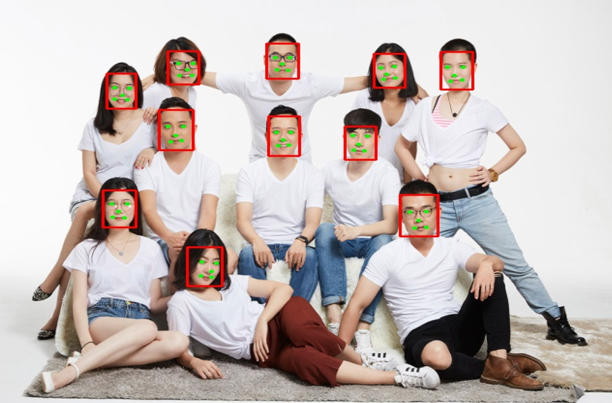

<table border="1">
  <tr>
    <th></th>
    <th></th>
    <th></th>
  </tr>
</table>

<h3>deeplearn-java</h3>	

<table class="table">
<thead>
<tr>
<th>
编号
</th>
<th>
项目
</th>
<th>
说明
</th>
</tr>
</thead>
<tbody>
<tr><td>1</td><td>action_rec_djl</td><td>  MXNet图片分类人体动作识别 , djl 推理</td></tr>
<tr><td>2</td><td>anime_gan</td><td>  使用ONNXRuntime部署人脸动漫化——AnimeGAN</td></tr>
<tr><td>3</td><td>bert_qa_djl</td><td>  bert 阅读理解（输入段落和问题,给出答案）  ,djl 推理</td></tr>
<tr><td>4</td><td>big_gan_djl</td><td>  BigGAN 图片生成,按照类别批量生成图片, djl 推理</td></tr>
<tr><td>5</td><td>bise_net</td><td>  使用BiSeNet做人脸面部解析</td></tr>
<tr><td>6</td><td>chexnet</td><td>  吴恩达团队检测肺炎模型 - CheXNet</td></tr>
<tr><td>7</td><td>chinese2english_translation_djl</td><td>  翻译 中文=>英语  中文分词,再进行翻译, djl 推理</td></tr>
<tr><td>8</td><td>chinese_error_recovery_macbert4csc</td><td>  加载macbert模型，中文拼写纠错</td></tr>
<tr><td>9</td><td>chinese_nlp_roberta</td><td>  中文填词预测 roberta</td></tr>
<tr><td>10</td><td>chinese_ocr_lite</td><td>  最轻量级中文 ocr</td></tr>
<tr><td>11</td><td>chinese_segment_lightltp_1</td><td>  中文分词 lightltp 中文词法分析（分词、词性标注）</td></tr>
<tr><td>12</td><td>chinese_segment_lightltp_2</td><td>  中文分词 lightltp 中文词法分析（分词、词性标注 => 命名实体识别）</td></tr>
<tr><td>13</td><td>clip_image_text_compare_djl</td><td>  clip 模型图片文本理解（openai） djl 部署, 文本和图片进行比较,计算图文相关性</td></tr>
<tr><td>14</td><td>crowd_density_dec_djl</td><td>  人群密度检测（PaddlePaddle-CrowdNet）,人计数,人流密度图  , djl 推理</td></tr>
<tr><td>15</td><td>dbnet_barcode_det</td><td>  dbnet 检测条形码</td></tr>
<tr><td>16</td><td>deeplabv3_obj_segmentation_djl</td><td>  deeplabv3 实例分割 ,  djl 推理</td></tr>
<tr><td>17</td><td>distilbert_sentiment_analysis</td><td>  DistilBERT 情感分析（英文文本），djl 推理</td></tr>
<tr><td>18</td><td>e2_pose_detection</td><td> E2Pose人体关键点检测</td></tr>
<tr><td>19</td><td>e2_pose_detection_video</td><td> E2Pose人体关键点检测</td></tr>
<tr><td>20</td><td>english_segment_ner</td><td>  英文命名实体识别 HuggingFace-Roberta NER (NLP)</td></tr>
<tr><td>21</td><td>face_alignment_mesh_pose</td><td>  人脸检测 + 对齐（密集点的3d重建也就是mesh重建）</td></tr>
<tr><td>22</td><td>face_det_retina_djl</td><td>  RetinaFace 模型人脸检测（5关键点）, djl 推理</td></tr>
<tr><td>23</td><td>face_det_ultra_light_djl</td><td>  Ultra-Light-Fast 模型人脸检测（5关键点）, djl 推理</td></tr>
<tr><td>24</td><td>face_feature_extraction_djl</td><td>  人脸特征提取 512 维, 相似度对比, djl 推理</td></tr>
<tr><td>25</td><td>face_land_mark</td><td>  人脸关键点检测，也就是人脸对齐</td></tr>
<tr><td>26</td><td>face_rec_det_insightface_pcn_1</td><td>  人脸检测（ insightface） + 人脸年龄性别检测 + 关键点识别 + 人脸特征提取  + 人脸匹配</td></tr>
<tr><td>27</td><td>face_rec_det_insightface_pcn_2</td><td>  人脸检测（ pcn） + 人脸年龄性别检测 + 关键点识别 + 人脸特征提取 + 人脸匹配</td></tr>
<tr><td>28</td><td>face_rec_det_insightface_pcn_3</td><td> 相似度判断人脸检测 => 关键点检测 => 人脸对齐 => 特征提取 => 相似度计算</td></tr>
<tr><td>29</td><td>face_rec_det_insightface_pcn_4</td><td>  人脸特征提取  =>  elasticsearch  人脸检索</td></tr>
<tr><td>30</td><td>face_rec_det_sface</td><td>  人脸检测与识别 sface  人脸检测(yunet) + 人脸编码128维(sface)</td></tr>
<tr><td>31</td><td>first_order_motion_model_jdl</td><td>  蚂蚁雅黑特效  first_order_motion_model  使用 jdl 推理</td></tr>
<tr><td>32</td><td>french2english_translation_djl</td><td>  翻译 法语=>英语  , djl 推理</td></tr>
<tr><td>33</td><td>gfp_gan_v1</td><td>  GFP_GAN_V1 人脸照片修复,增加清晰度</td></tr>
<tr><td>34</td><td>google_move_net_people_key_point</td><td>  google 的 movenet 人体17关键点检测</td></tr>
<tr><td>35</td><td>google_move_net_people_key_point_video</td><td>  google 的 movenet 人体17关键点检测</td></tr>
<tr><td>36</td><td>hand_3d_landmark</td><td>  手关键点检测 3d 注意模型需要结合手掌检测来完成,这里直接进行关键点检测所以要求直接输入手掌图片</td></tr>
<tr><td>37</td><td>hand_3d_landmark_camera</td><td>  手关键点检测 3d （相机检测）</td></tr>
<tr><td>38</td><td>hand_3d_landmark_video</td><td>  手关键点检测 3d （视频检测）</td></tr>
<tr><td>39</td><td>hand_palm_detection</td><td>  手掌目标检测, 标注首长起区域 + 掌心点 + 掌心上下两个关键点</td></tr>
<tr><td>40</td><td>id_card_licence</td><td>  身份证全卡面文字识别</td></tr>
<tr><td>41</td><td>id_card_rec_det</td><td>  文本识别 （高精度文本区域检测+文本识别）</td></tr>
<tr><td>42</td><td>informative_drawings</td><td>  使用ONNXRuntime部署Informative-Drawings生成素描画</td></tr>
<tr><td>43</td><td>mask_rcnn_resnet18_v1b_coco_seg_djl</td><td>  maskrcnn 实例分割 , djl 推理</td></tr>
<tr><td>44</td><td>metaai_sam_test_djl</td><td>  meta-ai sam  对所有对象进行分割 , 使用djl进行推理</td></tr>
<tr><td>45</td><td>metaai_sam_test_onnx</td><td>  meta-ai sam , 使用抠图点进行分割</td></tr>
<tr><td>46</td><td>mod_net</td><td>  实时人像抠图模型 背景实时替换</td></tr>
<tr><td>47</td><td>mod_net_video</td><td>  人像抠图 + 视频背景替换</td></tr>
<tr><td>48</td><td>m_lsd_line_detect</td><td>  M-LSD直线检测</td></tr>
<tr><td>49</td><td>nanodet_plus_object_dec</td><td>  NanoDet-Plus目标检测</td></tr>
<tr><td>50</td><td>opencv_selective_search_demo</td><td>  opencv 实现 rcnn 的 SelectiveSearch 算法</td></tr>
<tr><td>51</td><td>p2p_net_people_count</td><td>  P2PNet 检测人群以及人群计数</td></tr>
<tr><td>52</td><td>paddlepaddle_mattingv2</td><td>  百度PaddleSeg发布的实时人像抠图模型PP-MattingV2</td></tr>
<tr><td>53</td><td>paddle_ocr_djl</td><td> paddle ocr 字符识别  djl 推理</td></tr>
<tr><td>54</td><td>picodet_object_dec</td><td>  PicoDet目标检测</td></tr>
<tr><td>55</td><td>pose_estimation2_djl</td><td>  人体姿态估计（关键点）resnet18/resnet50模型  djl 推理</td></tr>
<tr><td>56</td><td>pose_estimation_djl</td><td>  人体姿态估计（17关键点检测）  djl 推理</td></tr>
<tr><td>57</td><td>pp_animals_classification</td><td>  动物图片分类 resnet50/mobilenet_v2 ,djl 推理</td></tr>
<tr><td>58</td><td>pp_coco_object_detection_djl</td><td>  coco数据集 pp开源模型目标检测,djl 推理</td></tr>
<tr><td>59</td><td>pp_deep_speech2text_long_djl</td><td>  deep sepeech （中英文）端到端语言识别模型,pp开源模型  djl推理</td></tr>
<tr><td>60</td><td>pp_deep_speech2text_short_djl</td><td>  deep sepeech （中英文）端到端语言识别模型,pp开源模型  djl推理</td></tr>
<tr><td>61</td><td>pp_dish_classification</td><td>  炒菜分类 resnet50/mobilenet_v2 ,djl 推理</td></tr>
<tr><td>62</td><td>pp_human_seg</td><td>  PP-HumanSeg肖像分割</td></tr>
<tr><td>63</td><td>pp_vehicle_detect_djl</td><td>  车辆检测 , pp开源模型 , djl 推理</td></tr>
<tr><td>64</td><td>rapid_asr</td><td>  语音wav转文字（语音识别+标点插入）Wenet</td></tr>
<tr><td>65</td><td>rapid_ocr</td><td>  捷智OCR - 文本区域检测 + 文本方向检测+ 文本识别</td></tr>
<tr><td>66</td><td>real_esrgan</td><td>  Real-ESRGAN - 图像超分辨率修复</td></tr>
<tr><td>67</td><td>retinaface_arcface</td><td>  人脸检测（retinaface） + 人脸识别（arcface）</td></tr>
<tr><td>68</td><td>robust_video_matting</td><td>  视频人像抠图</td></tr>
<tr><td>69</td><td>robust_video_matting_video</td><td>  视频人像抠图</td></tr>
<tr><td>70</td><td>safety_helmet_detect_darknet53_djl</td><td>  安全帽检测 , darknet53 模型 ,djl 推理</td></tr>
<tr><td>71</td><td>safety_helmet_detect_mobilenet1_djl</td><td>  安全帽检测 , mobilenet1.0 ,djl 推理</td></tr>
<tr><td>72</td><td>safety_helmet_detect_mobilenet2_djl</td><td>  安全帽检测 , mobilenet0.25 ,djl 推理</td></tr>
<tr><td>73</td><td>stable_diffusion_djl_cpu</td><td>  stable_diffusion AI画图，文生图  djl 推理</td></tr>
<tr><td>74</td><td>stable_diffusion_djl_gpu</td><td>  stable_diffusion AI画图，文生图  djl 推理</td></tr>
<tr><td>75</td><td>stable_diffusion_img2img_djl_gpu</td><td>  stable_diffusion AI画图，图生图  djl 推理</td></tr>
<tr><td>76</td><td>stable_diffusion_onnx</td><td> stable_diffusion AI画图，支持图生图、文生图</td></tr>
<tr><td>77</td><td>style_gan_cartoon</td><td>  使用 style-gan 将人脸头像转为卡通风格</td></tr>
<tr><td>78</td><td>style_transfer_djl</td><td>  动画风格迁移  djl 部署</td></tr>
<tr><td>79</td><td>super_resolution_djl</td><td>  超分辨率 esrgan-tf2 模型 ,  djl 推理</td></tr>
<tr><td>80</td><td>torcvision_keypointrcmm_resnet50_fpn_key_point</td><td>  pytorch 下面的 keypoint 算法</td></tr>
<tr><td>81</td><td>torcvision_maskrcnn_resnet50_fpn</td><td>  torcvision_maskrcnn_resnet50 实例分割</td></tr>
<tr><td>82</td><td>tts_mary_us_english</td><td> text2wav 美国英语 女性声音 (隐藏半马尔可夫模型-卡内基梅隆大学提供)</td></tr>
<tr><td>83</td><td>u2_net</td><td>  使用ONNXRuntime部署U-2-Net生成人脸素描画</td></tr>
<tr><td>84</td><td>ultra_fast_lane_detection_v2</td><td>  Ultra-Fast-Lane-Detection-v2 车道线检测</td></tr>
<tr><td>85</td><td>wav2vec2_speech2text_englinsh_djl</td><td>  语音识别（英文） wav2vec2 ,语言转文字 , djl 推理</td></tr>
<tr><td>86</td><td>whisper_speech2text_englinsh_djl</td><td>  whisper 语音识别（英文）,转文本（openai在9月发布的一个开源语音识别翻译模型）</td></tr>
<tr><td>87</td><td>yoloe_pp_hrnet_human_pose_estimation</td><td>  PP-YOLOE行人检测+HRNet人体骨骼关键点检测,姿态估计</td></tr>
<tr><td>88</td><td>yolov3_darknet53_pedestrian_djl</td><td>  yolov3 行人检测,djl 推理</td></tr>
<tr><td>89</td><td>yolov3_face_key_point_106</td><td>  yolov3 输入 112*112的人脸图片进行 106关键点检测</td></tr>
<tr><td>90</td><td>yolov4_fire_smoke_detect_djl</td><td>  yolov4 烟雾火灾检测（paddle模型） ,djl推理</td></tr>
<tr><td>91</td><td>yolov5_car_plate</td><td>  车牌检测 + 车牌字符/颜色识别</td></tr>
<tr><td>92</td><td>yolov5_cpu_gpu_test</td><td> 分别使用cpu和gpu进行推理速度比较 目标检测</td></tr>
<tr><td>93</td><td>yolov5_deepsort</td><td>  目标跟踪 deepsort + yolov5</td></tr>
<tr><td>94</td><td>yolov5_djl</td><td> yolov5 使用 djl 推理测试</td></tr>
<tr><td>95</td><td>yolov5_face_key_point_5</td><td>  使用 yolov5 人脸关键点检测 5 点</td></tr>
<tr><td>96</td><td>yolov5_face_mask_dec_djl</td><td>  yolov5 实现人脸口罩检测 , djl 进行onnx引擎推理</td></tr>
<tr><td>97</td><td>yolov5_predict</td><td> 目标检测</td></tr>
<tr><td>98</td><td>yolov5_predict_segment</td><td> 目标检测 + 实例分割  视频</td></tr>
<tr><td>99</td><td>yolov5_predict_video</td><td> 目标检测 + 实例分割  视频</td></tr>
<tr><td>100</td><td>yolov5_reflective_clothes_detect_djl</td><td>  yolov5 工作人员反光衣+安全帽检测 , 安全性检测 ,djl推理</td></tr>
<tr><td>101</td><td>yolov5_rotate</td><td>  使用ONNXRuntime部署yolov5旋转目标检测</td></tr>
<tr><td>102</td><td>yolov5_safety_helmet_detect_djl</td><td>  安全帽检测 , yolov5(s/m/l) 模型 ,djl 推理</td></tr>
<tr><td>103</td><td>yolov7_face_key_point_5</td><td>  使用ONNXRuntime部署YOLOV7人脸+关键点检测</td></tr>
<tr><td>104</td><td>yolov7_head_detection</td><td>  yolov7人头检测（人头密度检测）</td></tr>
<tr><td>105</td><td>yolovp2_detection_drive_area_line_384_640</td><td>  YOLOPV2目标检测+可驾驶区域分割+车道线分割</td></tr>
<tr><td>106</td><td>yolovp2_detection_drive_area_line_736_1280</td><td>  YOLOPV2目标检测+可驾驶区域分割+车道线分割</td></tr>
<tr><td>107</td><td>yolovp2_detection_drive_area_line_video_384_640</td><td>  YOLOPV2目标检测+可驾驶区域分割+车道线分割</td></tr>
<tr><td>108</td><td>yolovp2_detection_drive_area_line_video_384_640_write</td><td>  YOLOPV2目标检测+可驾驶区域分割+车道线分割  然后生成新的视频</td></tr>
<tr><td>109</td><td>yolovp2_detection_drive_area_line_video_736_1280</td><td>  YOLOPV2目标检测+可驾驶区域分割+车道线分割</td></tr>
</tbody>
</table>

